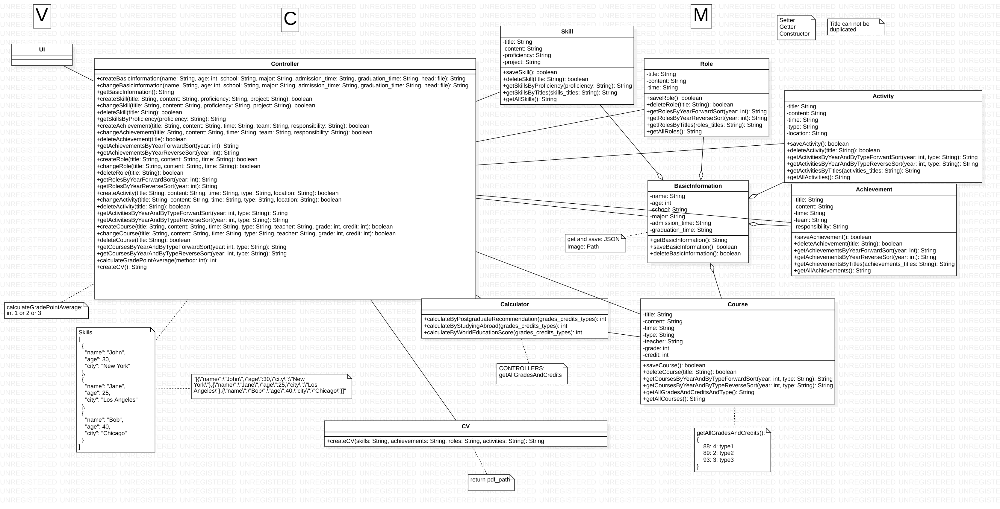

# Group Members
- Name: Kaixuan Hou  |  QMUL-ID: 200977375  
- Name: Wenxuan Wu  |  QMUL-ID: 200978925  
- Name: Zhengnan Cao  |  QMUL-ID: 200976884  
- Name: Yiru Li  |  QMUL-ID: 200977825  
- Name: ZiLong Wang  |  QMUL-ID: 200978800  
- Name: Yihan Zhu  |  QMUL-ID: 200979977  

#Product Backlog

  
# UML
  
  
# TDD-Controller Done!
  
  

# 重要信息
下面共有git教程、vscode需要安装的java插件、maven安装第三方库方法、maven的项目结构、TDD方式等信息。请大家耐心阅读。    
## vscode组件
我们统一安装组件Java Extension Pack（又名 Extension Pack for Java）  
这个组件包含的功能如下：  
  
  
## maven目录结构
  
  
解释一下你需要重点关注的文件夹：  
- src/main/java/: 除了用于测试的java文件，你其他所有的`xxx.java`文件都应该保存在该文件夹下的view或controller或model里（遵循MVC架构）。写好java文件后，对应的class后缀名文件会自动出现在target文件目录下的对应文件夹内，所以你完全不用关心target的文件夹下到底有什么  
- src/test/java/: 你所有的用于测试的java文件都应该放在这里，测试应该使用JUnit第三方库来完成，关于JUnit的使用方式放在后面再说   
- src/main/resources/: 资源文件都应该放在这里，例如图片、json文件、txt文件等  
  
**注意： 不要擅自更改目录结构！ 更改目录结构有可能导致maven配置文件的失效！**  

## maven导入依赖包
首先进入网页<https://central.sonatype.com/search>  
假如你要导入lombok库，直接在顶部搜索栏搜索lombok，在搜索结果中选择你要导入的库，点击该库进入详细页面，往下拉你会看到这个：  
  
将snippets下面的这几行代码复制下来，然后在我们的项目的根目录中找到配置文件`pom.xml`。接着在该文件的指定位置加入你所复制的代码，指定位置如下所示：  
   
  
保存文件后，从命令行进入有该配置文件的文件夹，然后输入`mvn clean install`    
出现以下信息，则保存成功：  
  
  
## Junit测试
为了方便大家理解，我在src/main/java/ 下新建了Student类，并在src/test/java/下新建了StudentTest类，方便大家理解如何完成测试   
下面是老师给的范例：  
  
这个老师给的实例实际跑起来有些问题，大家可以用做参考，实际用例请看我给的范例  
  
更多的测试函数如下：  
  
  
## git多分支管理
本次我们每个人一个单独的分支，来和main分支区分开。如果你是第一次使用git，请从下文的第一步开始看。如果你已经用过git，但是第一次使用多分支，请从第二步骤开始看。  

### 第一步
进入你的github页面，点击你的头像，点击repositories来进入仓库页面。  
点击绿色按钮New创建新的仓库，你只需要填写repository name（随便取个名字），然后拉到页面最下面，点击绿色按钮`Create repository`  
  
  
创建成功后，你可能会直接跳转到这一页：(如果没有跳转，从左上角头像 -> repositories来进入你刚刚新建好的库)    
  
  
第一个圈中，你可以选择HTTPS的方式或者SSH的方式，然后在命令行中新建一个文件夹，进入文件夹后运行第二个圈中的代码（会因为你选了HTTPS或SSH而不同）。  
  
如果你是第一次使用git上传文件，这里一定会出问题，此时你必须在你的电脑上配置好SSH或Github API等（选一个方式即可，我推荐ssh）。这里我也帮不了大家，任何报错可以直接搜索引擎或chatGPT   
  
**注意**: 你必须将README.md文件成功上传到你的新建的库中，确保无误后再进行第二步
  
### 第二步
在开始第二步前，确保你成功完成了第一步  
首先，创建一个文件夹，从命令行进入该文件夹(`cd`命令，不会命令行的请善用搜索引擎和chatgpt)，在命令行中输入`git clone https://github.com/Kygoss/studenthub`。  
此时，你的文件夹下会出现一个新的文件叫做studenthub，从命令行进入该文件夹，进入之后首先输入`git branch`，确保输出中有`* main`，如果没有，请联系hkx  
接着，使用`git branch xxxx`，这里的xxxx是你的新的branch的名称，你可以仿照我的branch的名称`KaixuanHou`，使用自己的名字作为branch名称  
  
再次`git branch`,这时候确保你的输出中有`* main`和你刚刚创建好的bran名称(如`KaixuanHou`)  
  
使用`git checkout xxxx`，xxxx为你刚刚建立的branch的名称。然后再次执行`git branch`，此时，你的输出中的`*`号应该从main移动到了你的branch上  
  
  
如果确认无误，则依次输入以下代码：
1. `git add *`
2. `git commit -m "wwx_hkx test commit"`
注释： "wwx\_hkx test commit"为提交的信息，这个信息应该规范为你的提交信息，这个信息不影响实际的提交过程。比如你是hkx，你第一次提交你的代码，则这里的信息可以写"HKX： first commit"，这里写好后，最终的成效如下：    
  
  
3. `git remote add wuwenxuan_origin git@github.com:Kygoss/studenthub`: 同样，这里首次创建origin，`wuwenxuan_origin`应该换成你想创建的自己的origin名字。 同时，请注意`git@github.com:Taylorblue123/webpageDesignLab-group35`应改为你在第一步中`remote add .....`时的路径名使用的方式，我这里是因为使用了SSH，如果你用了Github token，最后的这个路径名会不一样(*注意，第一次使用时需要remote add，之后再次使用时，比如下一次提交代码，只要你的origin还在，就可以使用相同origin，而不用重新remote add了*)    
4. `git push -u wuwenxuan_origin wuwenxuan`: 同样，倒数第二个参数改为你的origin名字，最后一个参数改为**你的分支的名字**
  
如果一切顺利，此时你登录github，到我们的项目页面，点左上角的main，你应该可以看到你自己刚刚创建好的分支：  
  
继续点击你的分支，进入你的分支中，看看你刚刚写好的文件是否都在这里  
如果没问题，接下来选择pull request  
  
  
点击右边的绿色按钮`New pull request`，然后在下面这里选择你自己的分支  
  
  
然后点击新页面的绿色按钮`Create pull request`，进入一个文本框，这里随便填几个字，点击下面的绿色按钮`Create pull request`  
最终如果你进入了这个页面，恭喜你提交成功，接下来等待管理员审核就可以了  

  
### 第三步
如果你已经成功完成了第二步，之后每次改代码时，你不再需要按照上述步骤执行，而是按照如下步骤：  
1. `git pull your_origin your_branch` (或 `git pull your_origin your_branch:main` 这个命令会整合main分支的所有最新内容到你的分支上，而前者只会拉取你的分支已存在文件的最新内容)。  pull下来之后就可以写你的代码了，写好之后下面三步命令就可以上传  
2. git add *  
3. git commit -m "xxxx"  
4. git push -u your_origin your_branch  
5. Github页面提交pull request审核  
